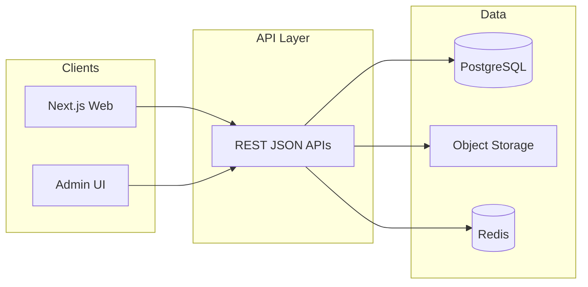

# Shop Marco — Backend architecture

> Հիմք՝ `Shop - Marco - code (2).pdf` (Functional Specification) և repo-ի ընթացիկ stack-ը (Next.js API, Prisma, PostgreSQL).

**Վերջին թարմացում.** 2026-04-16

---

## Նպատակ

Backend-ը ապահովում է e-commerce-ի տվյալների ամբողջականությունը, բիզնես-կանոնները (ներառյալ **Retail / Wholesale** առաքման լոգիկան), վճարումների և ադմինիստրացիայի API-ները, ինչպես նաև բազմալեզու կոնտենտի մատակարարումը։

---

## Stack (ընթացիկ repo)

| Շերտ | Ընտրություն |
|------|-------------|
| Runtime | Node.js (Next.js `src/app/api` կամ համարժեք API շերտ) |
| DB | PostgreSQL |
| ORM | Prisma (`shared/db/prisma`) |
| Cache / rate limit | Upstash Redis (ըստ կարգավորման) |
| Files | S3-համատեղելի object storage (ըստ կարգավորման) |

Նշում. Եթե ապագայում backend-ը տեղափոխվի առանձին NestJS ծառայության, domain-սահմանումները այս փաստաթղթում մնում են վավեր, փոխվում է միայն տրանսպորտի (HTTP host, auth middleware) շերտը։

---

## Բարձր մակարդակի տեսք

---

## Domain modules (լոգիկական)

### 1. Catalog & inventory

- Ապրանք, կատեգորիա, բրենդ, տեխնիկական հատկանիշներ (ֆիլտրերի համար)։
- Պահեստի վիճակ, գներ, զեղչեր, նկարների մետատվյալներ։
- **Product class** (կրիտիկական). `Retail` \| `Wholesale` — ազդում է առաքման կանոնների վրա։

### 2. Cart & pricing

- Զամբյուղի տողեր, քանակ, կիրառված promo-ներ։
- Գնային հաշվարկ (ներառյալ ակցիաներ) սերվերային վալիդացիայով (կլիենտը միայն ցուցադրում է)։

### 3. Orders & fulfillment

- Պատվերի կյանքի ցիկլ. `New` → `In process` → `Delivered` / `Canceled`։
- Առաքման եղանակ, հասցե, ադմին մեկնաբանություն, կարգավիճակի թարմացում։

### 4. Delivery rules (բիզնես-կանոն)

- **Միայն Retail** զամբյուղ → առաքում **Yandex**-ով (կամ ընտրված կուրիերով) — ինտեգրացիայի contract-ը առանձին adapter։
- **Wholesale** կամ **Mixed** (Retail+Wholesale) զամբյուղ → **անվճար առաքում** (կամ ֆիքսված կանոն — հաստատել բիզնեսով)։
- Կանոնները կիրառվում են checkout-ի և admin order view-ի ժամանակ։

### 5. Payments

- Քարտային վճարում (PSP webhook-ներ, idempotent order paid)։
- Կանխիկ — պատվերի մեջ մեթոդ, առանց արտաքին հաստատման, սակայն audit trail։

### 6. Promotions

- Promo code-ներ, կոնֆիգուրացվող զեղչեր (կատեգորիա/ապրանք/կարգ)։

### 7. Content & marketing

- Բաններ (hero), ակցիաների բլոկներ, բրենդ գործընկերների ցուցակ։
- **Reels** — վերտիկալ վիդեո ֆիդ, like-երի հաշվարկ։

### 8. Customers & auth

- Գրանցում / մուտք **email** կամ **phone** (նույն user մոդելի տարբեր identifier-ներ)։
- Պրոֆիլ, հասցեների կառավարում, պատվերների պատմություն, **reorder** (կրկնօրինակել զամբյուղ/պատվեր)։

### 9. Reviews & engagement

- Ապրանքի ակնարկներ, reiting, մոդերացիա (admin)։

### 10. Discovery

- Գլոբալ որոնում (ինդեքս՝ DB full-text / առանձին search engine — փուլային)։
- Wishlist, Compare — օգտատիրոջ կողմից պահվող ապրանքների հավաքածուներ։

### 11. Analytics (admin)

- Վաճառքի, կարգավիճակների, ապրանքների, պահեստի, հաճախորդների ագրեգատներ։
- Օգտագործել read-հարցումներ կամ materialized views ըստ բեռի։

### 12. i18n

- hy (primary), ru, en — թարգմանելի էնտիտիներ (կատեգորիա, ապրանք, CMS էջեր) API-ում `locale` պարամետրով։

---

## API սահմանում (խմբավորում)

| Խումբ | Նպատակ |
|-------|--------|
| `GET /api/.../products` | Ցուցակ, ֆիլտրեր, sort |
| `GET /api/.../products/:id` | Մանրամասն, կապակցված, պահեստ |
| `POST /api/.../cart` … | Զամբյուղ |
| `POST /api/.../checkout` | Պատվերի ստեղծում, վալիդացիա |
| `POST /webhooks/...` | Վճարում, առաքում (եթե կա) |
| `GET/POST /api/supersudo/...` | Ադմին CRUD, analytics |
| `GET /api/.../search` | Գլոբալ որոնում |

Ճշգրիտ path-ները համաձայնեցնել `docs/TECH_CARD.md` և API design կանոնների հետ։

---

## Տվյալների մոդել (կարճ)

Գոյություն ունեցող Prisma մոդելներից (`User`, `Address`, `Category`, `Product`, `Order`, …) — ընդլայնել ըստ անհրաժեշտության.

- **Product.productClass** (կամ համարժեք enum) — Retail / Wholesale։
- **Order** — status, deliveryMethod, paymentMethod, adminComment, deliveryCost, totals։
- **Promotion**, **PromoCode**, **Banner**, **Reel**, **ReelLike** — ըստ փուլերի։
- **ProductReview** — արդեն կապված է `User`-ի հետ schema-ում։

---

## Անվտանգություն և սահմաններ

- Մուտք գործած օգտատեր / ադմին RBAC։
- Բոլոր մուտքային DTO-ներ — սխեմայով (Zod)։
- Վճարային webhook-ներ — ստորագրություն / idempotency key։
- Գնային և պահեստային գործողություններ — տրանզակցիաներ կամ optimistic locking։

---

## Կապված փաստաթղթեր

- [Shop Marco — backend delivery & progress](./SHOP_SPEC_BACKEND_DELIVERY.md) — փուլերով առաջադրանքներ, % հետևում։
